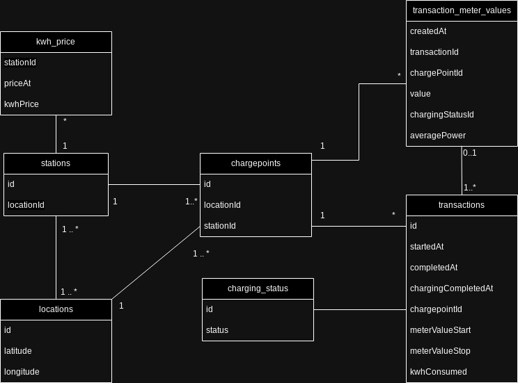

# Core logic

## Content
- [Relational DB Schema](#relational-db-schema)
- [Statistics Calculation And Aggregation](#statistics-calculation-and-aggregation)
  - [calculating kwhConsumed](#calculating-kwhconsumed)
  - [calculating turnoverEur](#calculating-turnovereur)
- [Calculating Charge Point Reliability](#calculating-charge-point-reliability)
- [Determining Charge Stations Within Radius (Km)](#determining-charge-stations-within-radius-km)
- [Misc](#misc)
  - [Raw Data Validation](#raw-data-validation)
  - [City / State Name Information From Location](#city--state-name-information-from-location)

## Relational DB Schema

------------------------------------------------------------------------------------------------

## Statistics Calculation And Aggregation

For calculating statistic (turnoverEur / kwhConsumed) for a charging station, city , or state
and aggregating it by time intervals (hourly, daily, allTime) the following algorithms are used:

### calculating kwhConsumed:
- retrieve all transaction data relevant to the station, city , or state
- handle transactions with negative kwhConsumed values -> use average kwhConsumed for all transactions
- aggregate by requested time interval (hourly, daily, allTime) and sum kwhConsumed for all transactions 

### calculating turnoverEur:
- retrieve all transaction data relevant to the station, city , or state
- handle transactions with negative kwhConsumed values -> use average kwhConsumed for all transactions
- determine kwh_price of the station at the staring time of the transaction
    - fallback to the average price of the station if no kwh_price was reported at the start time of the transaction
    - fallback to average price of all stations if the station has no kwh_price data at all
- compute turnoverEur for each transaction: turnoverEur = kwhConsumed * kwhPrice 
- aggregate by requested time interval (hourly, daily, allTime) and sum turnoverEur for all transactions

------------------------------------------------------------------------------------------------

## Calculating Charge Point Reliability

It's assumed that a charge point is 100% reliable, if it sends a status event every 15 minutes when a transaction is active. 

This assumption was made by analyzing the status events sent from reliable charge points. 

Reliability is determined by:

`Reliability (%) = (Number of successfully recorded events / Total number of expected events) × 100`

Where the number of expected events for a transaction is determined by `transaction duration by minutes // 15`

------------------------------------------------------------------------------------------------

## Determining Charge Stations Within Radius (Km)

Charge stations within a kilometer radius are determined by:
- filtering all locations in the database that are within the requested radius of the input location using  `geopy`'s 
 function `distance` that calculates the distance between two location points.
- determining all stations that are in the filtered locations.

------------------------------------------------------------------------------------------------
## Misc

### Raw Data Validation

After analyzing example raw data, the following issues were discovered: 

- Locations that were not in Germany
- Transactions without any corresponding status events from the charge point.
- Transactions that had a charging_started event, but no charging_stopped events from the charge point.
- Transactions that had a negative kwhConsumed values
- Stations with missing kwh_price

Note that there could be more issues that are still not discovered

### City / State Name Information From Location

For computing statistic details and aggregating them by City/State, it's needed to be able to bulk request 
the geological data. 

However, `geopy`'s geocoders that support bulk requesting geo data (like `GoogleV3` or `Bing`) require a paid API key.

The decision was made to use `geopy`'s geocoder `Nominatim` As it's free to use.

It unfortunately doesn't support bulk requesting geolocation data, and only allows 1 request/second. 

So it was decided to request the location data once with Nominatim and cache it internally. 

The cache will be updated as new locations get added. 

------------------------------------------------------------------------------------------------
